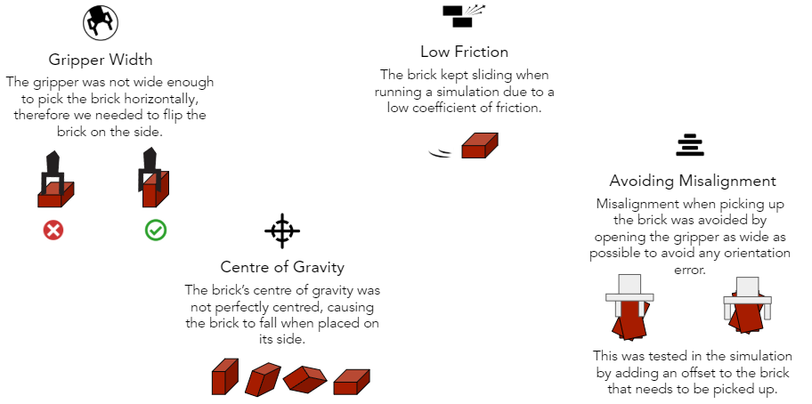

*****************************
Gazebo Limitations
*****************************

Resolving technical problems with the physics of the simulation in Gazebo significantly delayed our development process: it took us two weeks to solve the following four issues before being able to start writing and testing the motion planning code: 

    
#. Avoiding Misalignment
    The maximum gripper width was exactly the width of the brick in its standard, horizontal position. The gripper was occasionally able to pick bricks up, but it did so by pushing one side of the brick down and grabbing the brick diagonally. To avoid this imprecise and unreliable way of picking up bricks, we tried adding an offset to the width of the brick that needs to be picked up.
    
        <geometry>
          <box>
            <size>0.192 0.062 0.086</size>
        
#. Gripper Width
    The maximum width of the gripper, however, was too narrow to grasp bricks in the more stable horizontal position with the margin of safety that we input. We therefore tried to turn bricks on their side so they could be grasped with this configuration of the end effector. A week later, the gripper's model file was adjusted to make the gripper's starting position wider, solving this problem. 
    
        <link name="${ns}_leftfinger">
          <inertial>
            <mass value="0.1" />
            <origin xyz="0 0.0145644 0.0227941" rpy="0 0 0" />

        <link name="${ns}_rightfinger">
          <inertial>
            <mass value="0.1" />
            <origin xyz="0 0.0145644 0.0227941" rpy="0 0 ${pi}" />

    In the meantime, the team continously attempted to make bricks stand on their smaller side and encountered the following issues.
    
#. Centre of Gravity
    The brick's center of gravity was on one of its sides instead of being in the center. Since the brick also had extremely unrealistically low mass and friction, it kept falling back to the horizontal position no matter how precisely we rotated it. This issue was fixed by altering the brick's center of mass on the model file.
    
        <inertial>
          <pose frame=''>0 -0 0.031 0 -0 0</pose>
          <mass>0.1</mass>
          <inertia>
            <ixx>0.0017</ixx>
            <ixy>0</ixy>
            <ixz>0</ixz>
            <iyy>0.0017</iyy>
            <iyz>0</iyz>
            <izz>0.0017</izz>
    
#. Low Friction
    It was difficult to tune the coefficients of friction of the bricks in the model.sdf file. If the friction was too low, the brick would slip out from the gripper and either fall completely or move enough to cause misalignments that caused 'broke' our staircase when placing the brick. A low friction also made the piles of bricks extremely unstable when the brick that was being picked or places came in contact with them. If the friction was too high, the bricks could not be pushed by the robot as they required too much force. A high friction also caused problems due to extremely high shear forces between the brick that is being picked/placed and the brick under it. The following lines were adjusted:
    
        <surface>
          <friction>
            <ode>
              <mu>10000000</mu>
              <mu2>5000000</mu2>
              <fdir1>0 0 1</fdir1>
              <slip1>0.0</slip1>
              <slip2>0.0</slip2>
   
    In the end, friction was set to be low in order to make the staircase feasible. However, the bricks often slipped out of the gripper, and even when they didn't slip out completely accumulated misaligments often broke our staircase. This tendency to slip had to be compensated by lowering the brick's mass and the simulation's force of gravity. This fix, however, made the piles of bricks of both the feeding station and the staircase extremely unstable: small forces due to the end effector picking up or placing a brick would almost inevitably make the pile of bricks slide, and the accumulation of those misalignments often made the task fail.
